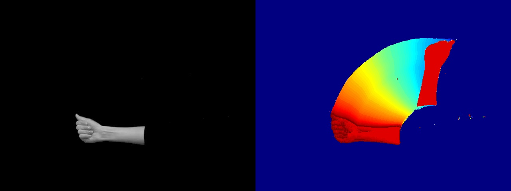
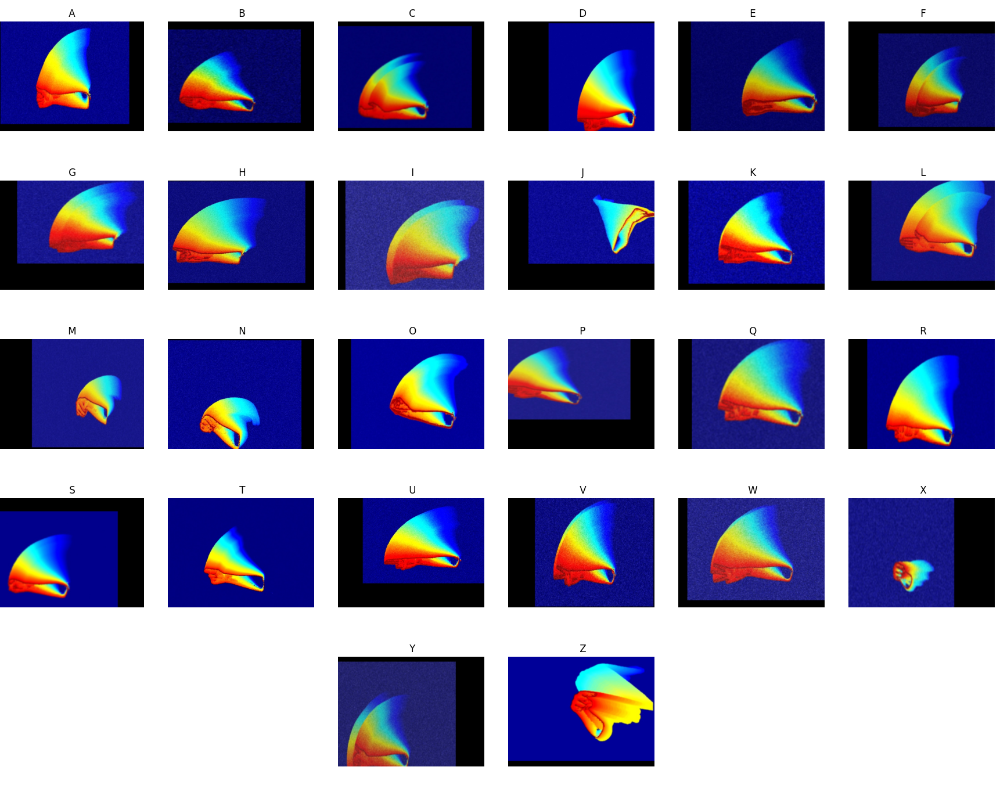
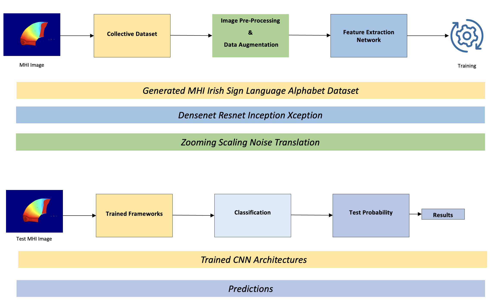
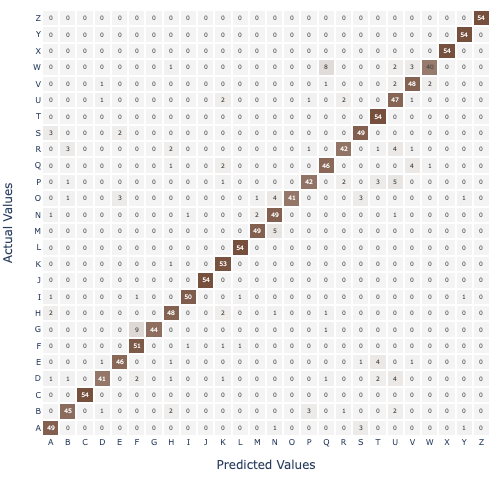

# Isolated Irish Sign Language Fingerspelling Recognition

This repository contains the implementation and research findings of a project aimed at recognizing the Irish Sign Language (ISL) alphabet using Motion History Images (MHIs) and Convolutional Neural Networks (CNNs). The project addresses the need for improved communication tools for the deaf and hard-of-hearing community by leveraging state-of-the-art deep learning techniques.

## Overview

The objective of this research is to enhance the recognition of Irish Sign Language fingerspelling through computational processing. This repository includes the following key components:

- **Dataset**: Utilization of the [Irish Sign Language Hand Shape (ISL-HS) dataset](https://github.com/marlondcu/ISL), which includes both static and dynamic gestures representing the ISL alphabet.
- **Feature Extraction**: Conversion of video frames into Motion History Images (MHIs) to capture the dynamic aspects of sign language gestures.
- **Data Augmentation**: Application of various augmentation techniques to expand the dataset and improve model robustness.
- **CNN Architectures**: Evaluation of multiple CNN models, including ResNet, Xception, Densenet, and Inception, to identify the most effective architectures for ISL recognition.
- **Experimental Results**: Detailed results demonstrating the accuracy and performance of each CNN model on the augmented MHI dataset.

## Methodology

1. **Data Preprocessing**: Conversion of the ISL-HS dataset into MHIs using custom Python scripts and OpenCV for capturing temporal motion information.

   

2. **Data Augmentation**: Implementation of augmentation techniques such as Gaussian noise, affine transformations, and scaling to enhance the dataset's diversity.

   

3. **Model Training**: Training various CNN architectures on the augmented dataset using TensorFlow and Keras, with fine-tuning to optimize model performance.

   

4. **Evaluation Metrics**: Assessment of models based on accuracy, precision, recall, and F1-Score to determine their effectiveness in recognizing ISL fingerspelling.

## Results

The research highlights that Densenet architectures achieved the highest accuracy rates. Below is the table of results:

| Model              | Accuracy (%) |
|--------------------|--------------|
| Densenet 121       | 90.38        |
| Densenet 169       | 89.60        |
| Densenet 201       | 90.10        |
| Xception           | 80.56        |
| ResNet 101 V2      | 85.62        |
| ResNet 50 V2       | 82.84        |
| ResNet 152 V2      | 82.24        |
| Inception ResNet V2| 77.64        |
| Inception V3       | 75.76        |

   

## Significance

This project contributes to the development of accessible communication technologies for the ISL community by providing a robust computational framework for sign language recognition. The methodologies and findings outlined in this repository aim to address the lack of communicative accessibility and foster inclusion for the deaf and hard-of-hearing community in Ireland.

## Future Work

Future research will explore more complex challenges such as automated sign language annotation and the development of real-time recognition systems to further enhance the accessibility and usability of these technologies.

---

Make sure to place the images in the `images` folder in your main repository directory for this to work properly.
